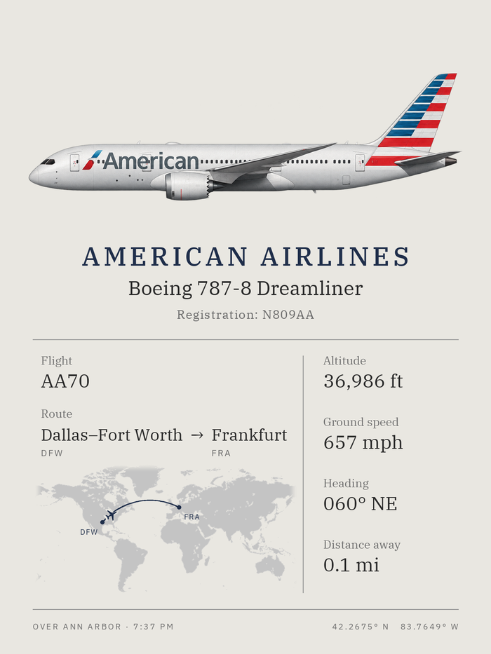
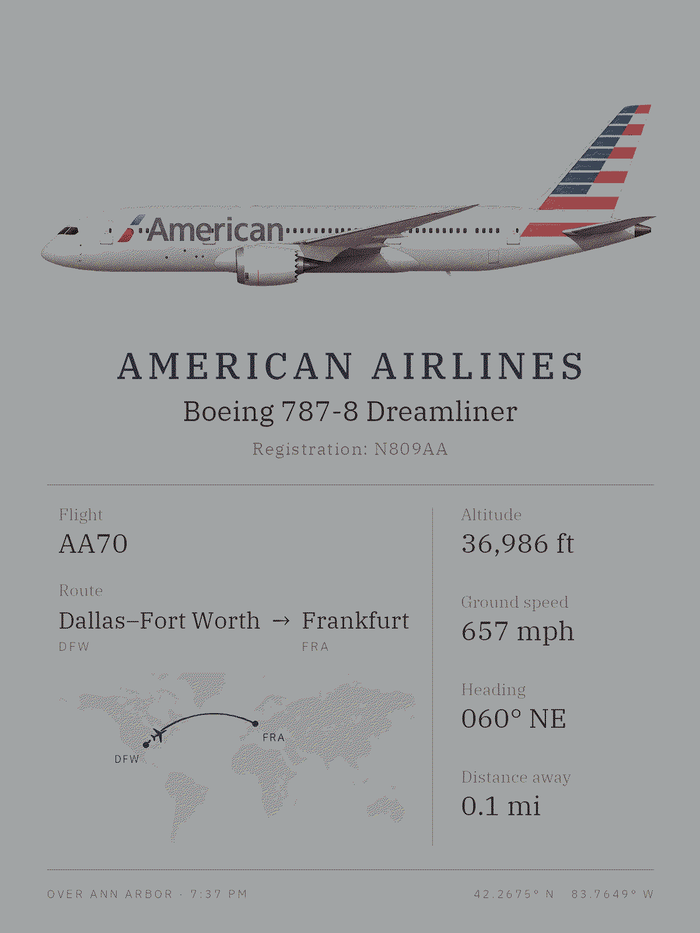

# airframe

**Wall art that shows the aircraft flying over your house right now.**

airframe watches the sky over one spot on the map, picks the most interesting aircraft in
range, and draws it as a poster on a 13.3" e-ink panel: the plane in its airline's livery,
where it's coming from and going to, how high and how fast. A few times an hour the picture
changes. There's no backlight and no glare, so on a wall it reads as a print that happens to
be about the plane you just heard go over.

It runs on a Raspberry Pi Zero 2 W, on data from [adsb.lol](https://adsb.lol), a community-run
ADS-B network.

> **Status:** the software is done and runs against live traffic, writing each frame to a PNG.
> The panel isn't wired up yet, so the e-ink driver and the systemd service are tested against
> a fake panel but unverified on real hardware.

---

## What's on the frame

| As rendered | As the panel shows it |
|:---:|:---:|
|  |  |

The panel has six colors and no greys, so everything else is dithered: that's the difference
between the two images above.

Artwork on top, then who's flying it and what it is, then the flight number and the route as
a great-circle line over a faint world map with the aircraft's position on it, next to the
numbers you'd want. The footer says when it was overhead.

Every field is optional. Private flights have a callsign and no route, small operators often
have no route data at all, and an aircraft nobody has drawn yet falls back through generic
artwork. Whatever isn't known isn't shown.

---

## How it works

```
 adsb.lol  ──▶  score  ──▶  identify  ──▶  draw  ──▶  e-ink panel
  (poll)      (pick one)   (who is it?)  (Pillow)    (or a PNG)
```

One process, one loop, no web server and no database. Every three minutes it asks adsb.lol
what's airborne within 15 nautical miles, scores what comes back, and redraws only if the
winner has changed.

### Picking one aircraft

Everything in range is scored out of 100, weighted `45 × interesting + 20 × close +
35 × drawable` by default:

- **Interesting:** 60% rarity, measured from a week of real traffic over your own location,
  and 40% notability (military, widebodies, foreign airlines, anything the aircraft database
  flags as unusual).
- **Close:** slant distance, so an airliner at 37,000 ft counts as further away than a Cessna
  at 3,000 ft. The Cessna is the one you can actually hear.
- **Drawable:** how well the artwork matches. Exact livery scores 1.0, the right airline on
  the right family 0.8, a generic aircraft of that type 0.5, a generic family silhouette 0.3.

That last weight is deliberately heavy. A rare jet drawn as an anonymous grey silhouette makes
a worse poster than a common one in its real colors, so the frame leans toward aircraft it can
actually show you.

Two rules keep the wall calm: an aircraft stays up at least three minutes while it's still in
range, and one that was just replaced doesn't come back for half an hour unless nothing else
is around. When the sky empties, the frame holds the last aircraft and changes its footer to
"Last seen at 7:37 PM".

### Working out what it is

ADS-B gives you a hex code, a callsign and a position. The rest is lookups:

- **Registration, type, owner:** [tar1090-db](https://github.com/wiedehopf/tar1090-db), the
  aircraft database readsb uses, indexed into SQLite on first run.
- **Route:** adsb.lol's callsign lookup, cached, which gives both airports with coordinates.
- **Livery,** which isn't the operator. Regional carriers fly partner colors: a SkyWest
  CRJ-900 out of Detroit is painted as Delta Connection, and that's what belongs on the
  poster. The brand is worked out from the registered owner, from operators that fly for one
  partner only, from flight-number blocks and from the route's hubs. If the evidence conflicts
  or runs out, the frame names the operator and draws a neutral aircraft rather than guessing
  at colors it can't prove.

### The artwork

Each image is generated and then curated by hand so the library reads as one series: side
profile, facing right, transparent background, no text or scenery. Every prompt is logged in
[assets/prompts/prompt-log.md](assets/prompts/prompt-log.md) so new images can be drawn to
match. Lookups fall back until something exists:

```
delta-connection_CRJ9.png     1. this airline, this exact subtype
delta-connection_CRJ-FAM.png  2. this airline, anything in the family
ANY_CRJ9.png                  3. any CRJ-900
ANY_CRJ-FAM.png               4. any CRJ
```

The library is 75 images. Over a sample week of real traffic, 89% of sightings get an image
and 51% get their exact livery. What to draw next isn't a guess either: the offline analysis
below ranks candidates by how much traffic each one would newly cover.

### Drawing to e-ink

The poster is composed at 1200 × 1600 with Pillow and rotated onto the panel, which is
landscape. The laptop preview simulates the six-color dithering, so artwork can be judged
before it ever reaches the hardware. A full refresh takes tens of seconds and visibly flashes
through every color, which is exactly why the frame only redraws when the aircraft changes.

---

## Hardware

| Part | Notes |
|------|-------|
| Raspberry Pi Zero 2 W | Quad-core A53, 512 MB RAM. Rendering a frame peaks around 130 MB. |
| Pimoroni Inky Impression 13.3" | 1600 × 1200, E Ink Spectra 6. Needs SPI, plus I2C for board detection. |
| A deep enough frame | The panel hangs portrait, and the poster is rotated to suit. |

---

## Try it without any hardware

Everything except the panel works on a laptop, writing the frame to `output/frame.png`.

```bash
python3 -m venv .venv
source .venv/bin/activate
pip install -e ".[dev]"

cp config/airframe.example.toml config/airframe.toml   # set your location
python -m airframe --once -v                           # one update, with the scores
python -m airframe                                     # keep running
```

The first run downloads the aircraft database and indexes it, which takes a minute.

To see the poster's other states without waiting for the right aircraft to fly over:

```bash
python -m airframe.preview        # ten sample frames -> output/preview/
```

Each sample is written twice, on screen and as the panel will show it. Between them they
cover an exact livery with a route, a generic fallback, an unresolved livery, a private
aircraft with no route, an aircraft nobody has drawn yet, and a held frame.

To replay a whole week through the real pipeline:

```bash
python -m airframe.analysis.replay --switches 100 --frame-seconds 3
```

This feeds a cached week of positions, written by the offline analysis below, through the same
scoring, selection and rendering the live app uses, and reports what got shown. It's the
quickest way to judge a scoring change or a new batch of artwork.

### On the Pi

Set `backend = "inky"` in the config and follow [deploy/README.md](deploy/README.md), which
covers the service user, the buses to enable and the systemd unit.

---

## Configuration

Copy `config/airframe.example.toml` to `config/airframe.toml`, which is gitignored and picked
up automatically. The knobs worth knowing:

| Setting | Default | What it does |
|---------|---------|--------------|
| `location.lat` / `lon` / `timezone` | Ann Arbor | Where the frame watches from |
| `traffic.radius_nm` | 15 | How far out to look, widening to `fallback_radius_nm` when the sky is empty |
| `traffic.refresh_seconds` | 180 | How often to poll |
| `traffic.min_display_seconds` | 180 | How long an aircraft stays up |
| `traffic.repeat_cooldown_minutes` | 30 | How long before the same aircraft can return |
| `scoring.*` | 45 / 20 / 35 | Interesting, close, drawable |
| `display.backend` | `png` | `png` on a laptop, `inky` on the Pi |
| `display.rotation` | 90 | Which way up the frame hangs |
| `display.units` | `imperial` | Or `aviation`, for knots and nautical miles |

---

## Tuning it to your own sky

The defaults suit Ann Arbor, which sits under Detroit's approaches. Somewhere else, different
aircraft are ordinary and different ones are worth a poster. An offline toolkit works that out
from real history, on a laptop only:

```bash
pip install -e ".[analysis]"
python -m airframe.analysis --days 7
```

Its settings (center point, radii to compare, airports to check) live in
`config/analysis.example.toml`. It reads adsb.lol's published history for that location and
writes a report and a stack of CSVs to `data/analysis/`, answering:

- **What actually flies over here?** Ranked types, airlines and liveries with weekly counts,
  which becomes the rarity table the live frame scores against.
- **Which artwork is worth drawing next?** Candidates ranked by the traffic each would newly
  cover, or upgrade from a silhouette to a real livery.
- **How far should the frame look?** 10, 15 and 20 NM side by side, and what each extra ring
  buys you. Mostly airport arrivals and departures, which may not be what you want.
- **Whose livery is that really?** Estimated brands per encounter with the evidence behind
  each, and the registrations most worth resolving by hand.

It also builds the library twice from alternating days and compares the two, which shows how
far one week's conclusions go.

### Getting the history without downloading the world

adsb.lol publishes each UTC day as a ~4 GB tar of per-aircraft traces with no geographic
index, so you can't ask it for one city. Alongside those traces it publishes 48 half-hour
*heatmap* files: ten-second position snapshots of everything flying, in fixed 16-byte records.
That's about 0.7 GB a day instead of 4 GB, and numpy filters one file down to a 25 NM circle
in roughly 12 milliseconds. Each day is reduced to the positions near you once and cached, so
re-runs and radius changes download nothing.

### What it can't tell you

- Livery brands are estimates. Inferred ones go wrong when an operator shuffles aircraft
  between partners, and special or retro liveries aren't detected at all.
- The aircraft database reflects today's registry, not the registry on the dates analyzed.
- Coverage depends on volunteer feeders, so low-altitude traffic far from one can be missed.

---

## Credits

- Aircraft positions and routes from [adsb.lol](https://adsb.lol), licensed
  [ODbL](https://opendatacommons.org/licenses/odbl/). Credit it wherever the art is shown.
- Aircraft registry from [tar1090-db](https://github.com/wiedehopf/tar1090-db), airline
  designators from readsb's operator list.
- Map from [Natural Earth](https://www.naturalearthdata.com/) land and lakes, public domain,
  simplified for the Pi.
- Type is [IBM Plex](https://github.com/IBM/plex) Serif and Sans, SIL Open Font License.
- Panel colors measured from [Pimoroni's inky driver](https://github.com/pimoroni/inky).

Licensed MIT.
